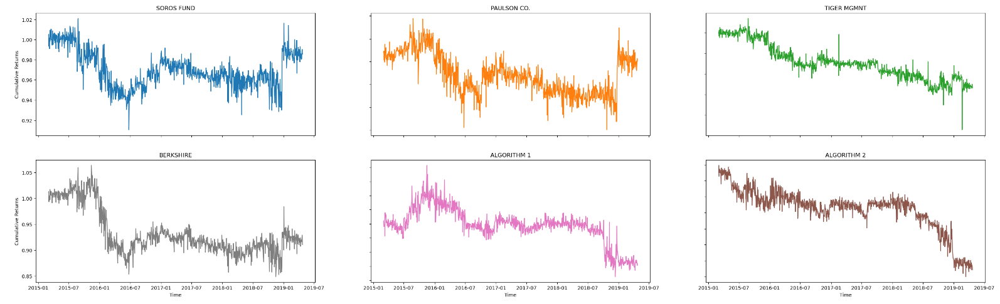

# Investment Portfolio Analysis
##### Created by [Demi Oyebanji](mailto:oluwademiladeoyebanji@outlook.com) as an assignment for the **UofT SCS Financial Technology Bootcamp**

This project is broken down into 6 main components:
- Analyzing the performance of large investment management firms like Soros, Berkshire Hathaway and Tiger Global
- Analyzing the performance of 2 automatic trading algorithms
- Analyzing the performance of the S&P500 Index
- Analyzing the returns of common stocks like NVIDIA and AMD
- Multiple plots and graphs to act as a visual aid for analysis

## Plot Examples:

### Returns

### Cumulative Returns

### Standard Deviation

